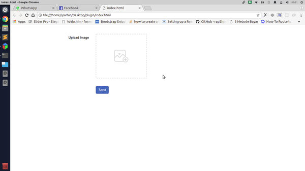

# spartan-multi-image-picker

This plugin enable you to upload multiple files on a html form without giving user a pain in the ass to hold their `Ctrl` keyboard.





### Installation

You must include [JQuery](https://nodejs.org/) first, and this plugin after that like so.
```html
<script type="text/javascript" src="https://code.jquery.com/jquery-3.3.1.min.js"></script>
	<script type="text/javascript" src="spartan-multi-image-picker.min.js"></script>
```

After doing that, create an element where do you want to activate this input file picker.

```html
<div class="row">
	<div id="coba"></div>
</div>
```

Activate this plugin.

```js
$("#coba1").spartanMultiImagePicker({
	fieldName:   'fileUpload[]'
});
```
The `fieldName` is your field name that this plugin will append as input type file to you html.

### All Properties

This is what you can custom when you call this plugin.

| Property | Type |
| ------ | ------ |
| `fieldName` | String |
| `maxCount` | Number |
| `rowHeight` | String, example : `200px` |
| `groupClassName` | String, example : `col-md-4 col-sm-4 col-xs-6` |

You can see the example in my `index.html` file.


### PS
This plugin run best using bootstrap 3 and you are my **alpha tester** :)
